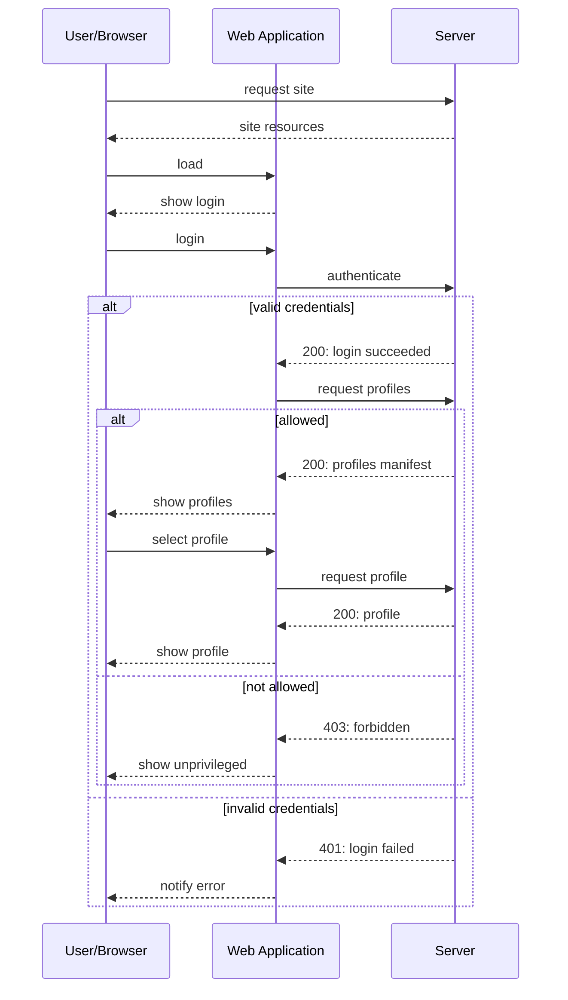

# Sequence Diagrams

## Story 1

```mermaid

sequenceDiagram
    participant User as User/Browser
    participant App as Web Application
    participant Server
    User->>Server: request site
    Server-->>User: site resources
    User->>App: load
    App-->>User: show login
    User->>App: login
    App->>Server: authenticate
    alt valid credentials
        Server-->>App: 200: login succeeded
        App->>Server: request profiles
        alt allowed
            Server-->>App: 200: profiles manifest
            App-->>User: show profiles
            User->>App: select profile
            App->>Server: request profile
            Server-->>App: 200: profile
            App-->>User: show profile
        else not allowed
            Server-->>App: 403: forbidden
            App-->>User: show unprivileged
        end
    else invalid credentials
        Server-->>App: 401: login failed
        App-->>User: notify error
    end
```
